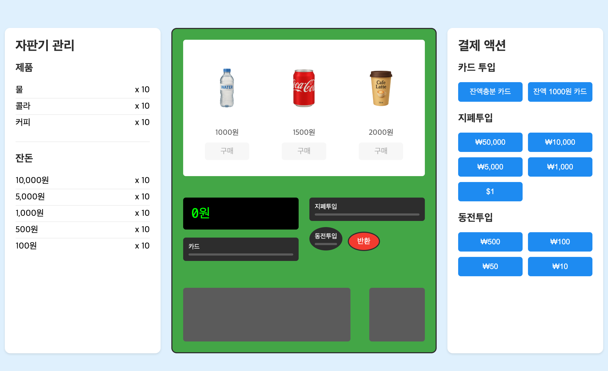

# Joy Vending Machine🧃

자판기의 핵심 동작 메커니즘을 시뮬레이션한 프로젝트입니다.  
현금 및 카드 결제, 재고 및 잔돈 표시, 다양한 경우의 수와 예외처리를 고려해 구현했습니다.

## 기술 스택


---

## 프로젝트 구조

```
joy-vending-machine/
├── src/
│   ├── assets/           # 이미지 파일
│   ├── managers/         # 핵심 로직 관리 클래스
│   │   ├── CardManager.ts    # 카드 결제 관리
│   │   ├── MoneyManager.ts   # 현금 결제 관리
│   │   └── ProductManager.ts # 상품 관리
│   ├── index.html        # UI 구조
│   ├── styles.scss       # 스타일 정의
│   ├── types.ts          # 타입 정의
│   └── vendingMachine.ts # 자판기 메인 로직
├── package.json          # 프로젝트 설정
└── README.md            # 프로젝트 설명
```

## 시스템 다이어그램 ( Flowchart )


- 입력(Input): 사용자는 돈을 넣거나 카드를 삽입하고, 원하는 상품을 선택
- 처리(Processing): 자판기는 잔액, 재고, 거스름돈 여부를 판단하여 상품선택 버튼을 활성화하고, 결제를 승인
- 출력(Output): 상품 및 잔돈이 반환되고 시스템은 초기 상태로 돌아감

## 실행 방법

**시스템 요구사항**

- Node.js 16.x 이상
- npm 7.x 이상

---

1. 저장소 클론

```bash
git clone https://github.com/your-username/joy-vending-machine.git
cd joy-vending-machine
```

2. 의존성 설치

```bash
npm install
```

3. 개발 서버 실행

```bash
npm start
```

## 실행 결과



## 주요 기능

### 자판기 관리

- 음료 재고 확인
- 잔돈 현황 확인

### 자판기

- **음료 구매**
  - 현금 구매 시 재고, 잔액, 거스름돈 가능여부 체크 후 음료 선택 활성화 -> 상품배출 -> 금액 차감
  - 카드 구매 시 재고 체크 후 선택 활성화 -> 카드 잔액 체크후 상품 배출
- **잔돈 반환**
  - 반환 버튼 클릭시 잔액이 있으면 큰 화폐 단위부터 계산된 알고리즘으로 반환
- **음료 및 잔돈 회수**
  - 아래의 음료 배출구 및 잔돈 배출구를 클릭해서 회수

### 결제 액션

- **카드**
  - 잔액충분 카드 (한도 없음) / 잔액 1000원 카드
  - 예외 테스트 : 잔액 1000원 카드로 잔액이 부족한 경우 시뮬레이션 가능
  - 카드 타임아웃 : 카드 삽입 시 60초 타이머 활성화되며 타임아웃 시 자판기가 초기모드로 돌아감
  - 현금 ↔ 카드 혼합 결제 불가
- **현금**
  - 유효한 금액 :100, 500 ,1000, 5000, 10000 원만 허용
  - 예외 테스트 : 50,000원, $1, 10원, 50원은 오류 메세지와 함께 즉시 반환됨
  - 최대 10000원까지만 투입 가능
  - 현금 ↔ 카드 혼합 결제 불가
